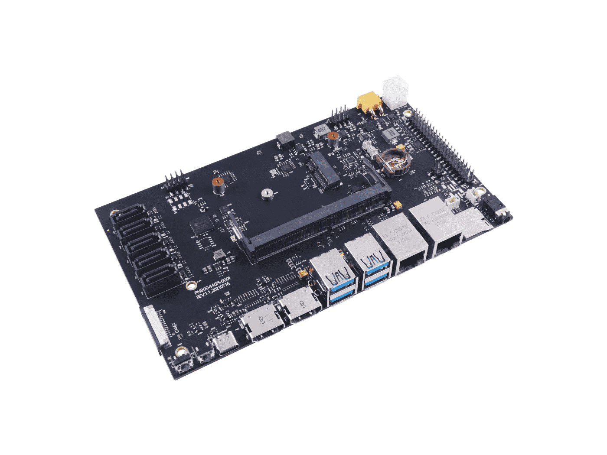
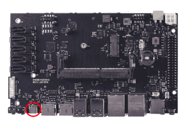
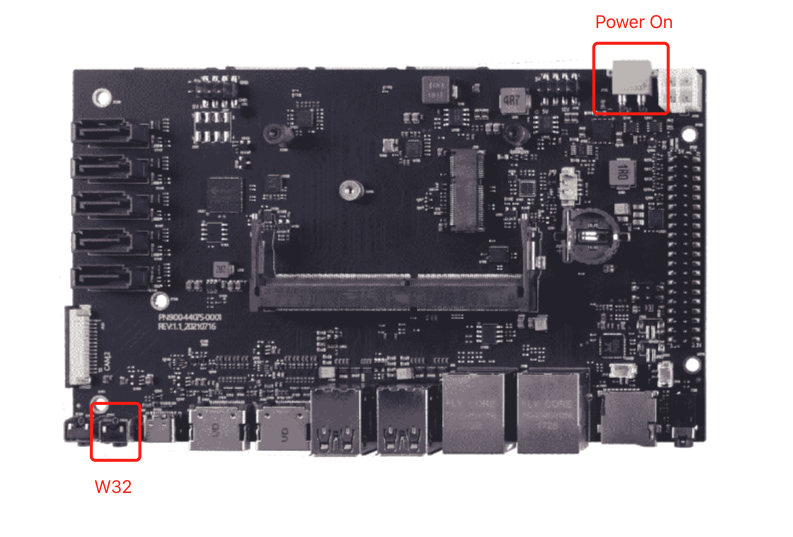
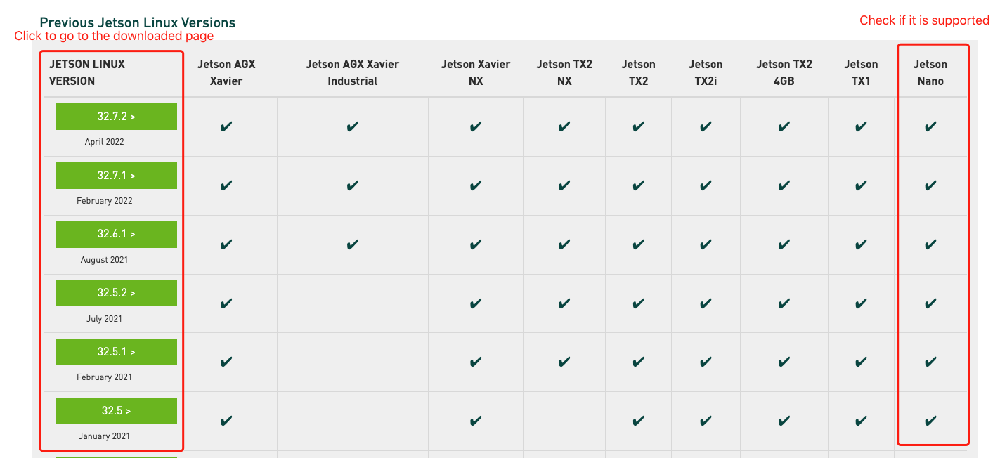
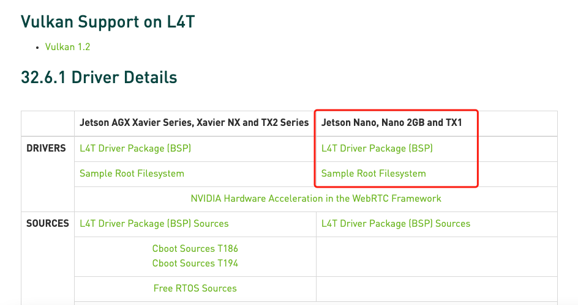

# Flash JetPack OS to A205 Carrier Board

How to flash Jetpack OS to the A205 Carrier Board which supports both NVIDIA Jetson Nano module and NVIDIA Jetson Xavier module. The A205 Carrier Board is different to the official NVIDIA Jetson Carrier Board.[Reference](https://wiki.seeedstudio.com/reComputer_A205_Flash_System/)
  
## Prerequisites
* [NVIDIA account](https://developer.nvidia.com/login)
* Linux Host Computer with Ubuntu 18.04 OS (or above)

## Hardware Preparation (Force Recovery Mode)
Before we can move on to the installation steps, we need to make sure that the board is in the force recovery mode. There are different types of the board, please note the difference.

1. First, we need to disconnect power of the board.
2. Connect your carrier board and your Linux host PC with a USB type-C link.
  
3. Power up and turn on board while pressing RECOVERY button (W32) and then release the button.
  
4. On the Linux host PC screen, we can right click the mouse to open a Terminal and enter the command `lsusb`. When the returned content has the `NVidia Corp`. in it, it means that your A205 Carrier Board is in force recovery mode and you can proceed to the subsequent operations.

The ID depends on the modules on the carrier board and the information show as below:
* For Jetson Nano: 0955:7f21 NVidia Corp
* For Jetson Xavier NX: 0955:7e19 NVidia Corp
* For Jetson TX2 NX: 0955:7c18 NVidia Corp
  

## Process
### 1. Download the proper NVIDIA Linux Driver Package
  On the Linux host PC, Open a browser and go the Jetson Linux Archive. First we should check if the version of Jetson Linux is supported.
  
  Once you find the proper version, click to go to the downloaded page. Find and click the "L4T Driver Package (BSP)" and "Sample Root Filesystem" to download the driver files. The names of the files are like:
  * `Tegra_Linux_Sample-Root-Filesystem_Rxx.x.x_aarch64.tbz2`
  * `Jetson-210_Linux_Rxx.x.x_aarch64.tbz2`
  
  As the example, we choose the NVIDIA L4T 34.1.1 version since it is included as part of JetPack5.0.1 , the names of the files:
  * `Tegra_Linux_Sample-Root-Filesystem_R32.7.2_aarch64.tbz2`
  * `Jetson-210_Linux_R32.7.2_aarch64.tbz2`
### 2. Unzip Package Files and Assemble the Rootfs via Command Line
  Go to `/home/USER` (USER is the name of your ubuntu user):
  ```BASH
  cd ~
  ```
  Create the folder `projects` and inside create the folder `L4T_drivers`:
  ```BASH
  mkdir projects
  mkdir projects/L4T_drivers
  ```
  Go to `projects/L4T_drivers` and unzip the `Jetson_Linux`
  ```BASH
  cd projects/L4T_drivers
  tar xf ../../Downloads/Jetson_Linux_R35.1.0_aarch64.tbz2
  ```
  Go to `Linux_for_Tegra/rootfs/` and unzip the `Sample_Root_Filesystem`:
  ```BASH
  cd Linux_for_Tegra/rootfs/
  sudo tar xpf ../../../../Downloads/Tegra_Linux_Sample-Root-Filesystem_R35.1.0_aarch64.tbz2
  ```
### 3. Include Proper Drivers(optional)
* Choose the driver file.
  | Carrier Board |	Jetson Module       	| JetPack Version | L4T Version	| Download Address |
  |---------------|-----------------------|-----------------|-------------|------------------|
  |     A205	    | Jetson Nano eMMC	    |       4.6	      |     32.6.1	|     [Download](https://files.seeedstudio.com/wiki/NVIDIA/A205_jp4.6_nano.zip)     |
  |     A205	    | Jetson Xavier NX eMMC |	      4.6	      |     32.6.1	|     [Download](https://files.seeedstudio.com/wiki/NVIDIA/A205_jp4.6_nx.zip)     |
  |     A205	    | Jetson TX2NX eMMC     |       4.6	      |     32.6.1	|     [Download](https://files.seeedstudio.com/wiki/NVIDIA/A205_jp4.6_tx2nx.zip)     |
  |     A205	    | Jetson Xavier NX eMMC	|       5.0.2     |    	35.1.0	|     [Download](https://files.seeedstudio.com/wiki/A205/205nx_jp5.0.2.zip)     |

  There are two JetPack 5.0.2 drivers for A205 included in the downloaded files. Both work fine, except that one of them supports IMX-219 camera and the other one supports IMX-477 camera.

* Go to `~/Downloads` and unzip the driver downloaded
  ```BASH
  cd ~/Downloads
  unzip 205nx_jp5.0.2.zip 
  ```
* Copy and replace the driver to the `Jetson_Linux` drivers:
  ```BASH
  cp -a -f 205nx_jp5.0.2/205nx_jp5.0.2_imx477/Linux_for_Tegra/kernel/dtb/tegra194-p3668-0001-p3509-0000.dtb ../projects/L4T_Drivers/Linux_for_Tegra/kernel/dtb/
  ```
### 4. Flash the System to the Board
* Make sure to have installed the following packages:
  ```BASH
  sudo apt-get install qemu-user-static 
  sudo apt-get install -y lz4
  ```
* Go to `/home/USER` (USER is the name of your ubuntu user):
  ```BASH
  cd ~
  ```
* Go to `projects/L4T_Drivers/Linux_for_Tegra` 
  ```BASH
  cd projects/L4T_Drivers/Linux_for_Tegra/
  ```
* Run the following command:
  ```BASH
  sudo ./apply_binaries.sh
  ```
    Expected output
    ```BASH
    yankee@yubuntu:~/Desktop/L4T_Drivers/Linux_for_Tegra$ sudo ./apply_binaries.sh 
    Using rootfs directory of: /home/yankee/Desktop/L4T_Drivers/Linux_for_Tegra/rootfs
    Installing extlinux.conf into /boot/extlinux in target rootfs
    Processing triggers for nvidia-l4t-kernel (5.10.104-tegra-35.1.0-20220810203728) ...
    ...
    ...
    Processing triggers for libc-bin (2.31-0ubuntu9.9) ...
    /home/yankee/Desktop/L4T_Drivers/Linux_for_Tegra
    Removing QEMU binary from rootfs
    Removing stashed Debian packages from rootfs
    L4T BSP package installation completed!
    Disabling NetworkManager-wait-online.service
    Disable the ondemand service by changing the runlevels to 'K'
    Success!
    ```
* Run the next command:
  ```BASH
  sudo ./flash.sh jetson-xavier-nx-devkit-emmc mmcblk0p1
  ```
    Expected output:
    ```BASH
    ###############################################################################
    # L4T BSP Information:
    # R35 , REVISION: 1.0
    ###############################################################################
    # Target Board Information:
    # Name: jetson-xavier-nx-devkit-emmc, Board Family: t186ref, SoC: Tegra 194, 
    # OpMode: production, Boot Authentication: NS, 
    # Disk encryption: disabled ,
    ###############################################################################
    copying soft_fuses(/home/yankee/Desktop/L4T_Drivers/Linux_for_Tegra/bootloader/t186ref/BCT/tegra194-mb1-soft-fuses-l4t.cfg)... done.
    ./tegraflash.py --chip 0x19 --applet "/home/yankee/Desktop/L4T_Drivers/Linux_for_Tegra/bootloader/mb1_t194_prod.bin" --skipuid --soft_fuses tegra194-mb1-soft-fuses-l4t.cfg --bins "mb2_applet nvtboot_applet_t194.bin" --cmd "dump eeprom boardinfo cvm.bin;reboot recovery" 
    Welcome to Tegra Flash
    version 1.0.0
    Type ? or help for help and q or quit to exit
    Use ! to execute system commands
    
    [   0.0857 ] Generating RCM messages
    ...
    ...
    [ 648.5108 ] Bootloader version 01.00.0000
    [ 648.5374 ] Writing partition MEM_BCT_b with mem_coldboot_sigheader.bct.encrypt [ 198656 bytes ]
    [ 648.5383 ] [................................................] 100%
    [ 651.1718 ] Flashing completed

    [ 651.1719 ] Coldbooting the device
    [ 651.1739 ] tegrarcm_v2 --ismb2
    [ 651.2193 ] tegradevflash_v2 --reboot coldboot
    [ 651.2200 ] Bootloader version 01.00.0000
    *** The target t186ref has been flashed successfully. ***
    Reset the board to boot from internal eMMC.
    ```

    After the flash the board can be fully apply.
